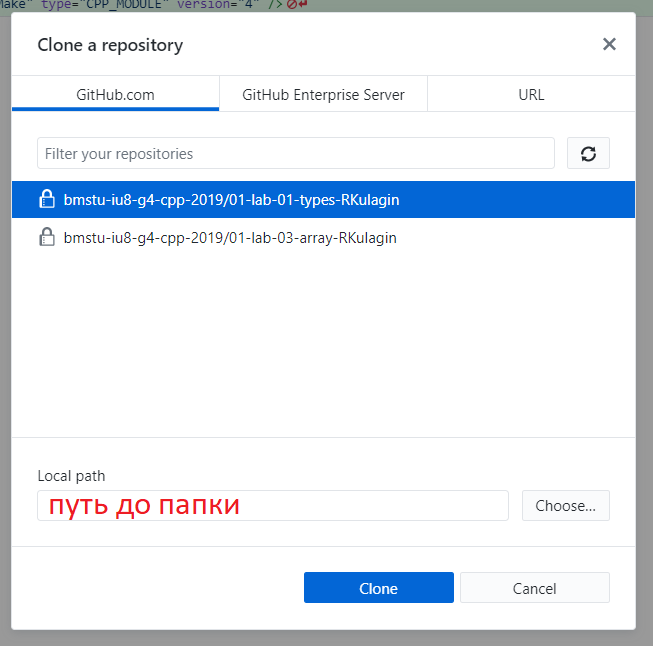
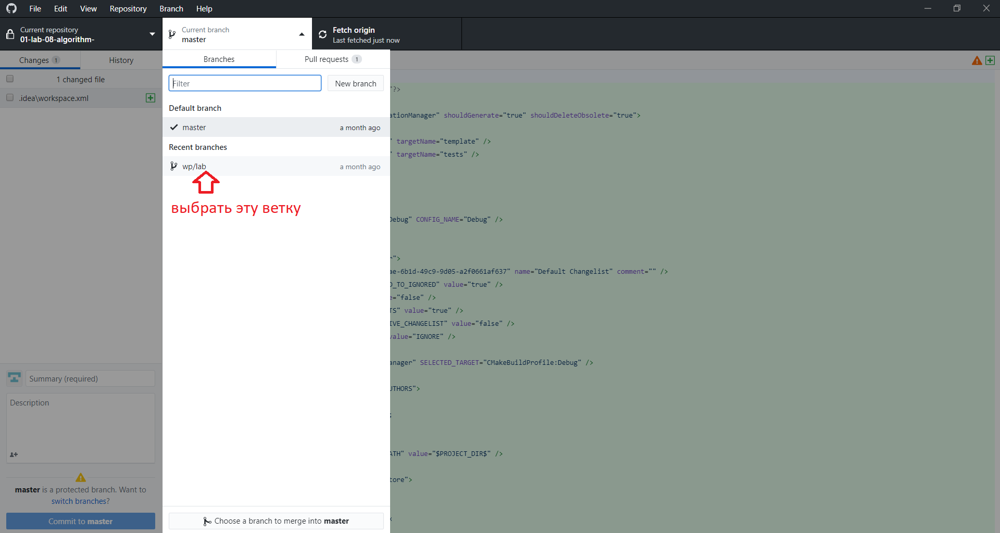
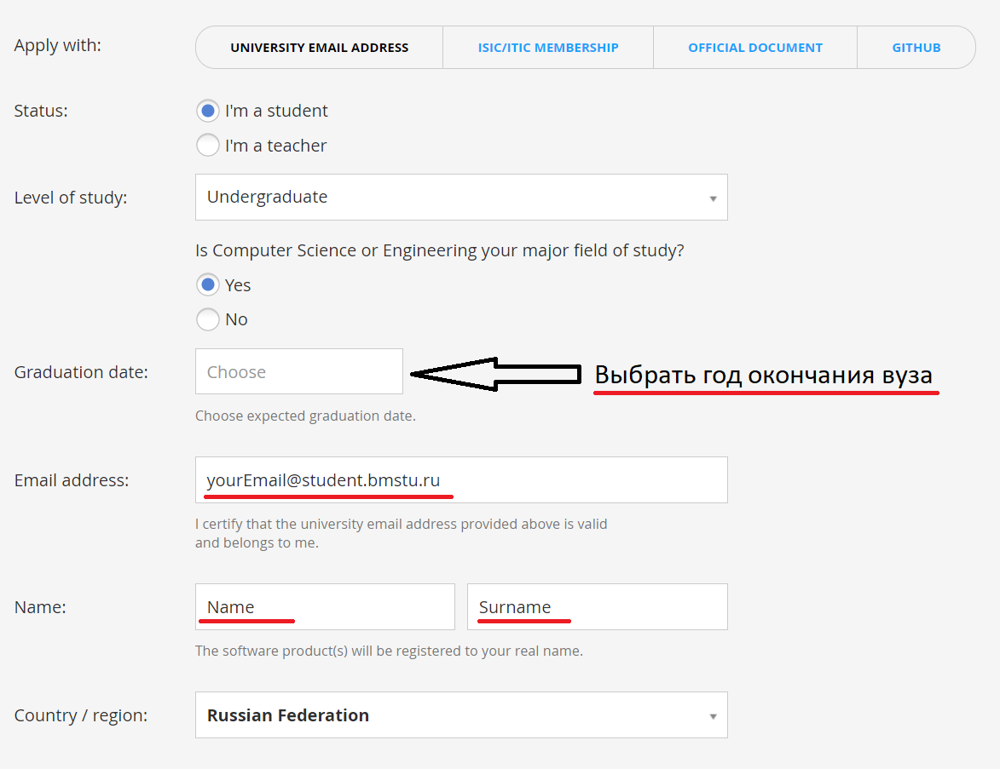
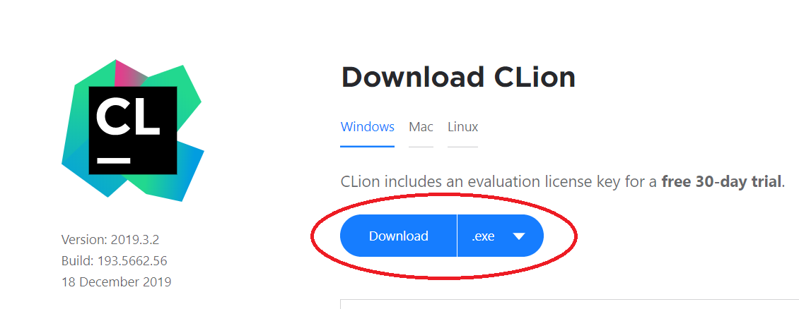
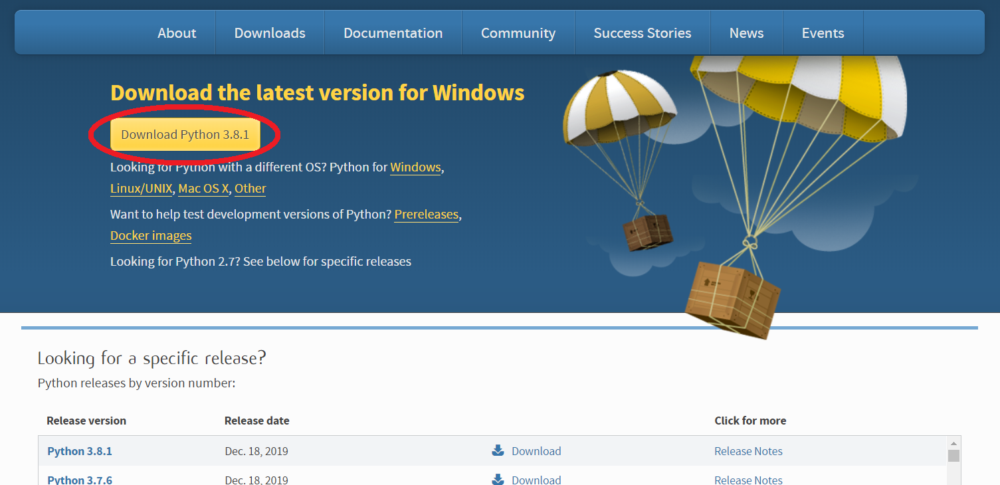
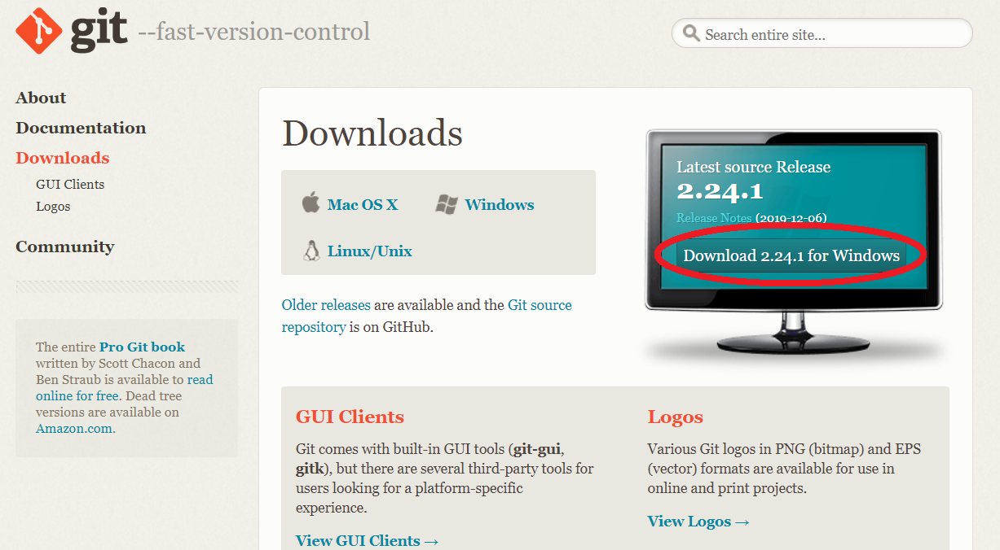
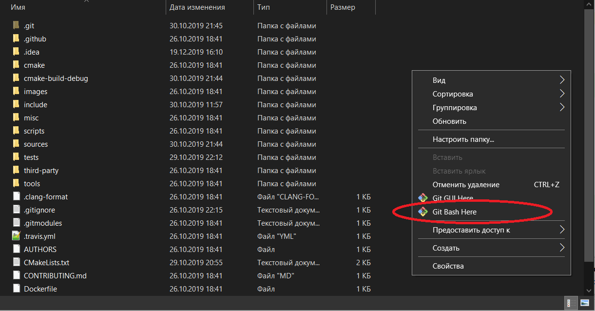
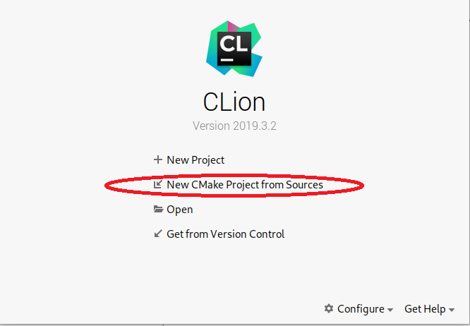

## Как начать делать лабы по АЯ. Windows.

### Введение.
Данный туториал написан для студентов МГТУ им Н. Э. Баумана и в частности для ИУ8 ради облегчения их нелёгкого пути ~~по морям дискретной математики~~ в лабораторных работах по Алгоритмическим языкам.

Перед тем, как мы начнём, хочу вас в последний раз предостеречь от выполнения лаб
под виндой. Линукс - то, с чем вам всё равно придётся подружиться рано или поздно.
И поверьте, на примере как своём, так и многих-многих тех, кто пытался что-то мудрить
со своей лицензионной виндушечкой, которая шла вместе с ноутом, а потому было слишком 
тяжело с ней расставаться. Для таких моментов существует такая вещь как установка двух ОС
рядом, при таком раскладе вы просто выбираете нужную вам операционку при старте загрузчика grub:


В последний раз прошу вас рассмотреть этот вариант и не идти дальше и посмотреть в
сторону того же [Ubuntu](https://ubuntu.com/download)(годный дистрибутив для начинающих в линукс).

Нет? Ну ок, ты это сам выбрал, друг мой)))

## План действий.
 - Установка Github Desktop.
 - Установка CLion.
 - CLion. Начало работы.
 
### Ставим Github Desktop.

Если вы мало знакомы с командами гита, то эта программа с графическим интерфейсом поможет вам на
первом семестре. Чтобы клонировать репозитории и хранить их локально на своей машине, вносить изменения
на удалённый репозиторий и так далее.

* Качаем, устанавливаем [Github Desktop](https://desktop.github.com/)

* Само собой логинимся через учётку github.

* В Github Desktop: `File -> Clone repository` и выбираете нужный Вам репозиторий



* ветка `master` - эталонная, своего рода шаблон для начала лабы. В неё мы не вносим изменения.
Чтобы начать делать лабу, нам нужно создать свою ветку (обычно её называют `wp/lab`). Сделать это можно, нажав
`New branch` в разделе с ветками. (смотри скрин ниже)

* Изменить ветку на `wp/lab`


 
### Как установить CLion и настроить Gtest

* Подать заявку на предоставление бесплатной лицензии [JetBrains Products for Learning](https://www.jetbrains.com/shop/eform/students)



(То, что подчёркнуто красным нужно заполнить)

* Скачать [CLion](https://www.jetbrains.com/clion/)



* Установить CLion. 

Установка стандартная, ничего дополнительно нажимать не требуется(только при желании это сделать)

* Активировать CLion, используя университетскую почту
(P.S. если вы её до сих пор не получили, получите в ГЗ в 91 кабинете)

* Далее нужно скачать [Python](https://www.python.org/downloads/) 
 

 
Установка стандартная, не требует дополнительных действий. Просто нажимаем далее, если спрашивают. Ничего не меняем
 
* И [Git Bash](https://git-scm.com/download)



Установка стандартная, не требует дополнительных действий. Просто нажимаем далее, если спрашивают. Ничего не меняем

Заходим в папку с клонированным репозиторием в проводнике. Кликаем ПКМ и выбираем Git Bash Here



И выполняем эту команду.

```shell script
git submodule update --init
```

* Запускаем CLion

* Выбираем пункт New CMake Project from Sources или `File -> New CMake Project from Sources`



* Выбираем папку с локальным репозиторием (обратите внимание, нужна именно папка, содержащая папку `.git`)


* Важно! Нажимаем Open Existing Project. Иначе CMakeLists.txt перезапишется


* Готово. Если делаете всё в первый раз на данной машине, то стоит немного подождать, пока Hunter скачает и установит необходимые зависимости  

### Начинаем работу.